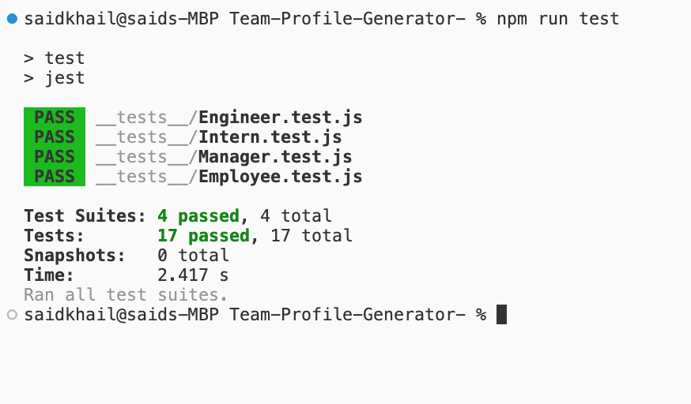

# Team-Profile-Generator-

## Description

The Team Profile Generator is a Node.js command line application (CLI) designed to streamline the process of collecting and showing information about employees in a software engineering team by using user input it generates a HTML webpage displaying a user information. The application uses inquirer version 8 and Jest for testing.

## Usage

1. Clone the repository to your local machine using:
   ```
   git clone https://github.com/SKhail/Team-Profile-Generator-.git
   ```
2. Navigate to the cloned directory
3. Install dependencies by running
   ```
   npm install
   ```
4. Start the Application by running:
   ```
   node index.js
   ```
5. Follow the prompts to input information
6. Once completed, it will generate a formatted
   HTML page
7. Screenshot shown below:

   

## Installation

1.  Clone the repository to your local machine
2.  Navigate to the directory where you want to clone the repository

    ```
    git clone https://github.com/SKhail/Team-Profile-Generator-.git
    ```

    ```
    npm install
    ```

3.  You can use the application

## Feature

1. Used Jest testing framework to make sure the application is working correctly
2. Interacted CLI for getting employees informations
3. Generating HTML webpaged based on the CLI prompts

## Credits

N/A

## License

This project is licened under the MIT License.

[](https://opensource.org/licenses/MIT)

## Tests

This application includes tests written with Jest.

  

## Resources

[https://www.npmjs.com/package/inquirer]

[https://jestjs.io/docs/getting-started]
